# Information Architecture Final Project

### Group 4 - Team Members
| Name     | Email                |
|----------|----------------------|
| Mazaltov | mazal-tov.amsellem@mail.yu.edu       | 
| Manling | myang3@mail.yu.edu       | 
| Julian   | jaruggie@mail.yu.edu | 

## Context
Among the most fundamental children rights is the right to survive. 
While substantial progress in child survival has been made in the past 30 years, in 2018 alone, estimated 5.3 million children died before reaching their fifth birthday.
We aim to understand how this problematic is impacting different regions and countries around the world along with the main reasons of death.


### The Main Process and our steps
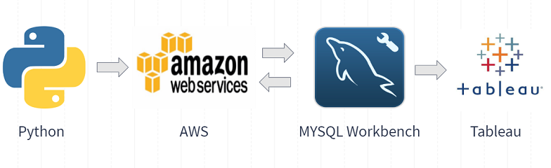

1. Specify data sources: World Development Indicators (WDI - unstructured) and the World Health Organization (structured).
2. Create a RDS SQL instance and S3 bucket in AWS.
3. Create a relational data model (OLTP - Staging Schema).
4. Scrape data from HWO and save in S3 bucket using a Lambda function.
5. Move data from S3 to RDS Staging Schema with a Lambda function.
6. Create a dimensional model (OLAP), named mortality_mart.
7. Load data from OLTP to OLAP schema using Lambda functions that execute SQL Store Procedures.
8. Connect Tableau to MYSQL Workbench to create visualizations that helps us answer our research questions.

### Prerequisites
The lambda packages include the configuration files to access RDS and S3 credentials to use in s3fs.

- World Bank API Wrapper
- s3fs to save data to an S3 Bucket
- BeautifulSoup and Selenium to scrape data from WHO
- Download chrome webdriver and add .exe path into web_driver_to_s3.py


```
aws configure
pip install world_bank_data
pip install s3fs
pip install BeautifulSoup
pip install Selenium

```

## Architecture in AWS
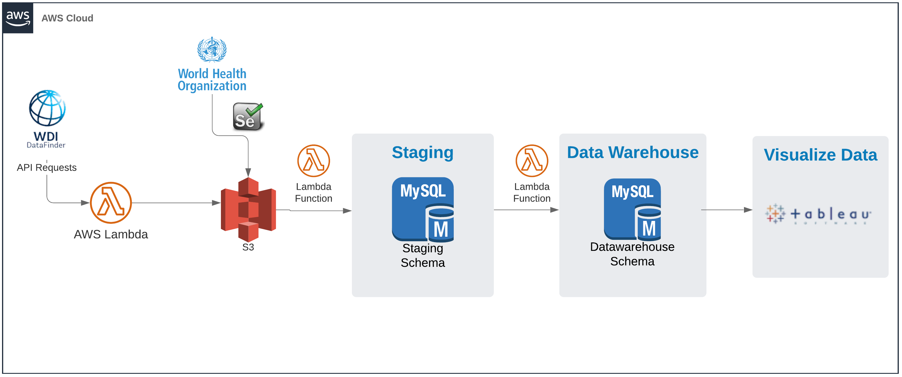

## Research Questions

We are going to explore the relevant data and answer some of the following questions:
1. What was the estimate for child mortality under 5 across every country in 2018?
2. How does income impact child mortality rates?
3. Which are the main reasons that impacted child mortality in 2018? What about in 2000?
4. How has mortality changed over time for regions? 
5. Which countries have more than “x” rate in under 5 mortality because of nutrition problems?
6. Which country had the highest decrease in the under 5 child mortality rate in the last 10 years?
7. What is the under 5 child mortality rate across different regions?
8. How is the income group related (correlation) to more child mortality rates?

## Data sources:

### 1. World Development Indicators (WDI)

The data we get from WDI API is related to:
 - Regions (Latin America, South Asia, Sub-Saharan Africa, etc).
 - Countries.
 - Income Groups per year (High income, Low income, Lower middle income, Upper middle income).
 - Indicator 1: Under 5 child mortality rates per 1000 births by year and by country.
 - Indicator 2: Gross National Product (GNI) per year per country.

 
Once these entities are gathered we save csv files to s3 folder 'WDI' running a Lambda function, main code is in Scripts/WDI_API_to_S3.py
(To explore the WDI we use world_bank_data library, the API v2 implementation in Python.) https://pypi.org/project/world-bank-data/

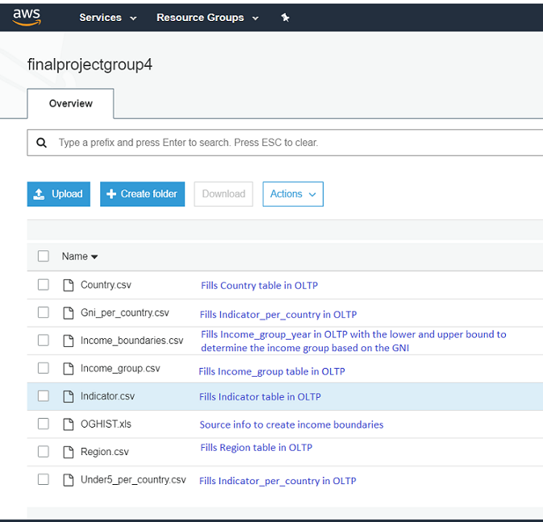


### 2. World Health Organization (WHO)

We access the Global Health Observatory data repository under the URL below:
https://apps.who.int/gho/data/node.main.ChildMortCTRY2002015?lang=en

In this website we can find Child mortality's Rate of deaths by cause and by country, starting with HIV/AIDS.
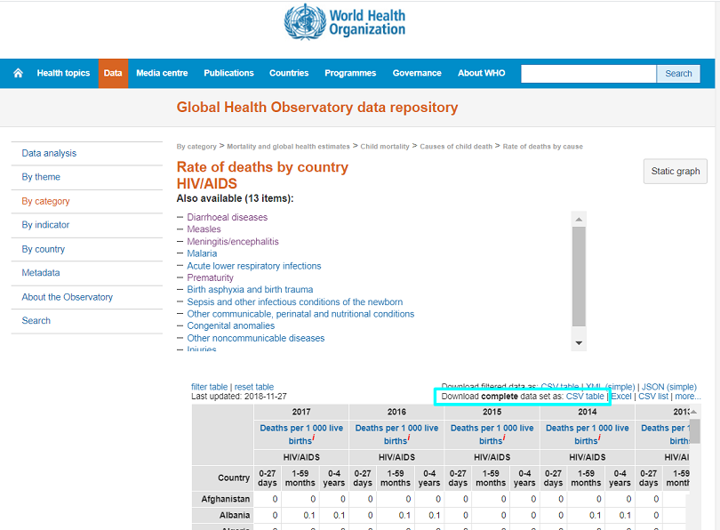


We use web scraping with Python and Selenium to download the corresponding information for each of the 12 remaining reasons below, accesing each element in the list and taking the 'href' value to navigate into the next page:

- Diarrhoeal diseases
- Measles
- Meningitis/encephalitis
- Malaria
- Acute lower respiratory infections
- Prematurity
- Birth asphyxia and birth trauma
- Sepsis and other infectious conditions of the newborn
- Other communicable, perinatal and nutritional conditions
- Congenital anomalies
- Other noncommunicable diseases

Our interest is to get the value corresponding to the under5 child mortality rate per each country:
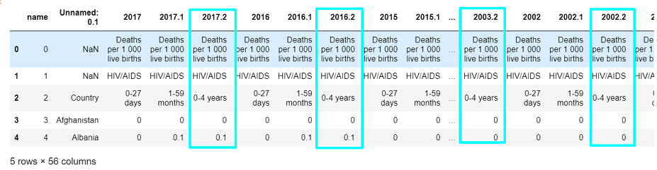


After making the corresponding data wrangling in python we save one file per reason in a s3 bucket, 'WHO' folder.
The code corresponding to scraping the WHO website and saving the file to a s3 bucket is under Scripts/WHO_scraping_to_s3.py

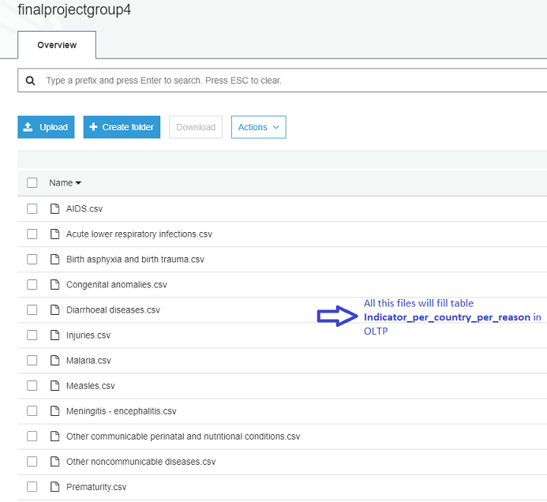

#### Lambda Functions and Scripts mapping
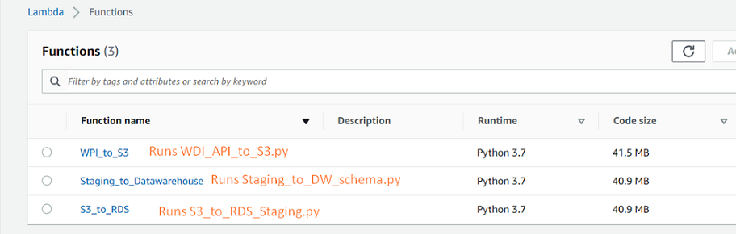

### Design and Planning

### 1. OLTP Diagram
https://dbdiagram.io/d/5ea6393239d18f5553fe4069

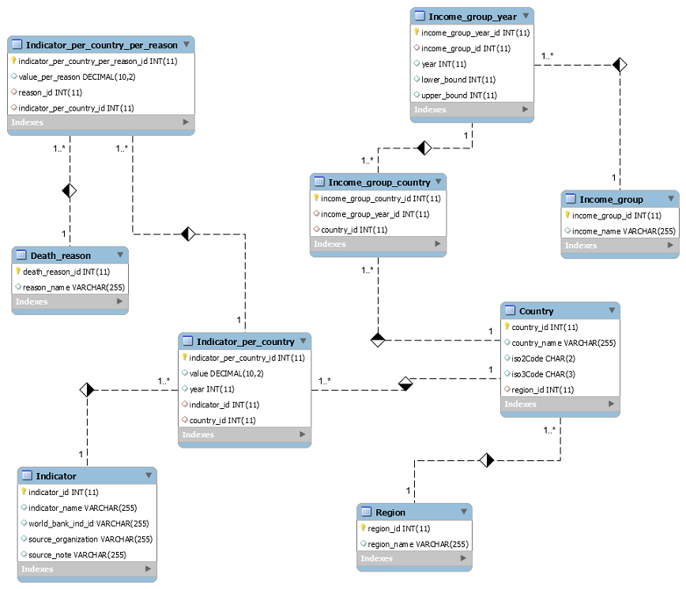

Code to load the data from S3 to Staging OLTP schema is under Scripts/S3_to_RDS_Staging.py

### 2. Star Schema Diagram

Code to load the data from Staging OLTP to schema to OLAP DW schema is under Scripts/Staging_to_DW_schema.py

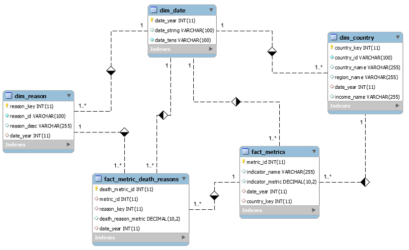

### Visualizations
##### 1. Dashboard 1
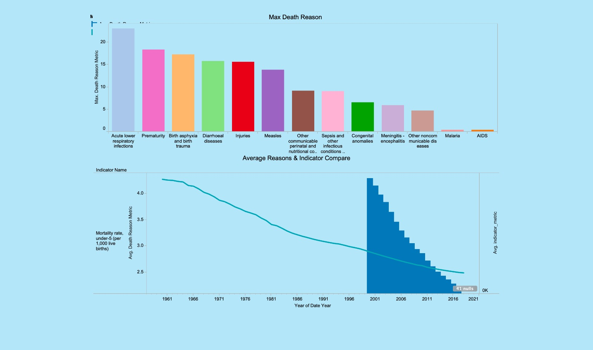
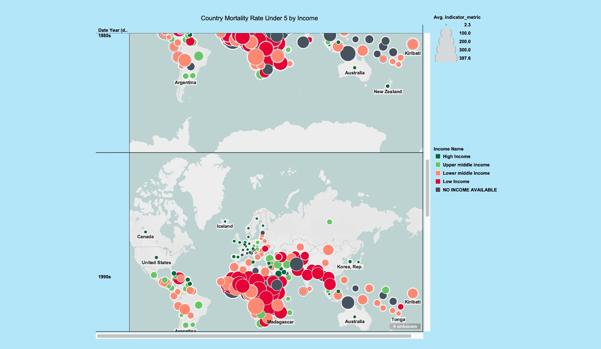
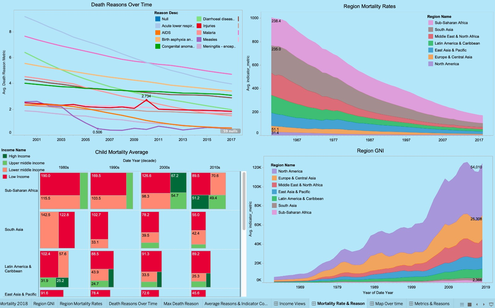
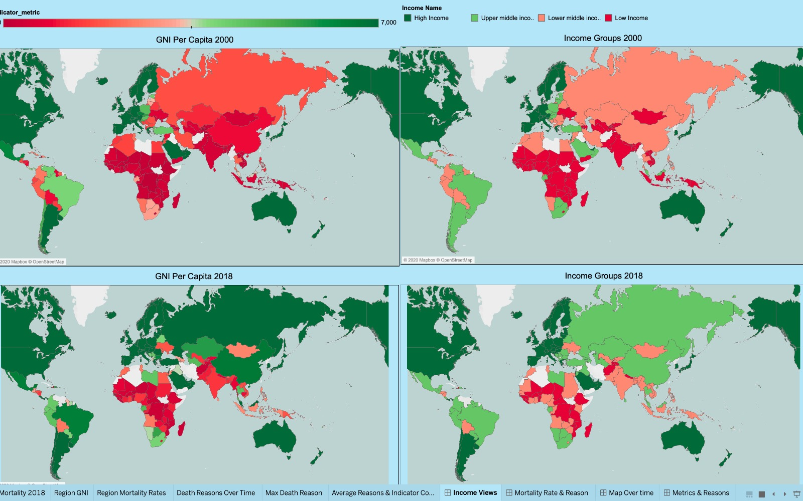
